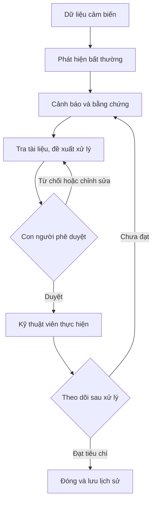
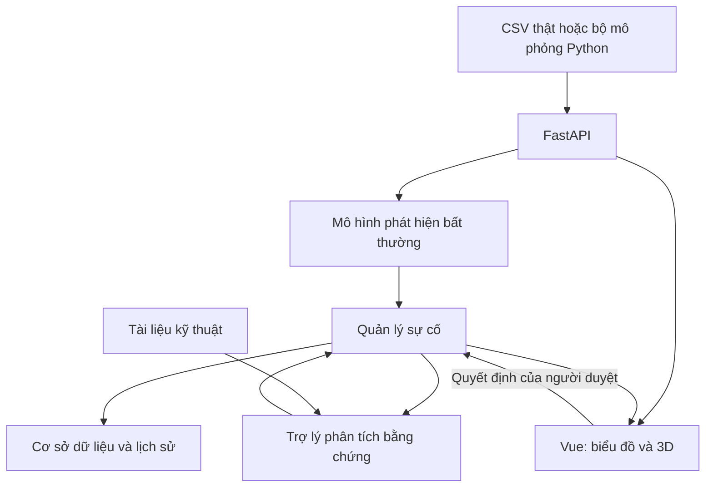

# DENSO A1 — Tài liệu tổng hợp dự án FactoryDoctor

> Cập nhật: **09/09/2026**. Đây là bản tổng hợp ý tưởng, quyết định, hiện trạng code và kế hoạch triển khai trong một file.
>
> **Tình trạng ngắn gọn:** đã có giao diện Vue chạy bằng dữ liệu giả lập, đã gộp bản Tailwind + VueApexCharts vào `main`. Đã thực hành đọc, khảo sát và chia dữ liệu trên Kaggle theo kết quả trao đổi. Chưa có bằng chứng xác nhận mô hình học máy đạt chất lượng, chưa nối FastAPI, AI hoặc mô hình 3D vào web.

## Mục lục

1. [Dự án giải quyết vấn đề gì?](#1-dự-án-giải-quyết-vấn-đề-gì)
2. [Phạm vi đã thống nhất](#2-phạm-vi-đã-thống-nhất)
3. [Luồng sử dụng và các màn hình](#3-luồng-sử-dụng-và-các-màn-hình)
4. [Bộ công nghệ](#4-bộ-công-nghệ)
5. [Code hiện tại hoạt động thế nào?](#5-code-hiện-tại-hoạt-động-thế-nào)
6. [Dữ liệu và tiến độ học máy](#6-dữ-liệu-và-tiến-độ-học-máy)
7. [Mô phỏng và 3D](#7-mô-phỏng-và-3d)
8. [Backend và AI dự kiến](#8-backend-và-ai-dự-kiến)
9. [Đã làm, đang làm, sẽ làm](#9-đã-làm-đang-làm-sẽ-làm)
10. [Kế hoạch đến mốc nộp](#10-kế-hoạch-đến-mốc-nộp)
11. [Đánh giá và thí nghiệm](#11-đánh-giá-và-thí-nghiệm)
12. [Cách tải và chạy dự án](#12-cách-tải-và-chạy-dự-án)
13. [Kịch bản trình diễn](#13-kịch-bản-trình-diễn)
14. [Việc cần xác nhận và giới hạn](#14-việc-cần-xác-nhận-và-giới-hạn)
15. [Thuật ngữ và nguồn tham khảo](#15-thuật-ngữ-và-nguồn-tham-khảo)

## 1. Dự án giải quyết vấn đề gì?

| Nội dung | Thông tin |
|---|---|
| Cuộc thi theo ngữ cảnh dự án | DENSO Hackathon 2026 |
| Chủ đề | Predictive & Knowledge AI — AI dự báo và khai thác tri thức |
| Nhóm | A1 |
| Tên đề tài | Predictive-Maintenance AI Despite Scarce Fault Data — AI hỗ trợ bảo trì dự đoán trong điều kiện ít dữ liệu lỗi |
| Tên sản phẩm đang dùng | FactoryDoctor |
| Kho mã nguồn | https://github.com/hieppham02/denso |
| Công cụ thực hành dữ liệu | Kaggle Notebook |
| Công cụ quản lý công việc | Trello đã được người dùng tạo; chưa có đường dẫn/bảng công việc được kiểm tra trong lần tổng hợp này |
| Mốc nộp từng bàn | 12/10/2026; cần đối chiếu thông báo cuộc thi để xác nhận yêu cầu chính thức |

Máy móc tạo ra nhiều dữ liệu trong lúc hoạt động bình thường, nhưng thường có ít ví dụ lúc hỏng. Vì vậy, việc dạy máy tính nhận biết từng loại lỗi bằng hàng nghìn mẫu lỗi không phải lúc nào cũng khả thi.

Ý tưởng của nhóm: học đặc điểm hoạt động bình thường, phát hiện dấu hiệu khác thường, đối chiếu tài liệu kỹ thuật để đề xuất cách xử lý, cho con người phê duyệt và tiếp tục theo dõi sau xử lý.

**Giá trị muốn chứng minh:** nối được dữ liệu cảm biến với một quy trình bảo trì có căn cứ và có kiểm tra kết quả. Riêng phát hiện bất thường chưa đủ chứng minh dự báo trước hỏng; muốn tuyên bố dự báo sớm phải đo được thời gian cảnh báo trước sự cố trên dữ liệu kiểm tra.

Người dùng dự kiến:

- Người vận hành: xem toàn bộ thiết bị và nhận biết máy cần chú ý.
- Kỹ thuật viên: xem cảm biến, bằng chứng và phương án xử lý.
- Người phụ trách: phê duyệt phương án và theo dõi kết quả.

Đây là các vai trò thiết kế sản phẩm; hệ thống đăng nhập và phân quyền thật chưa được triển khai.

## 2. Phạm vi đã thống nhất

### 2.1. Phạm vi nghiên cứu

- Một loại thiết bị trước: máy nén khí/cụm cấp khí.
- Bộ dữ liệu chính đang thực hành: MetroPT-3.
- Dạng sự cố chính: rò khí.
- Hướng học máy ban đầu: học dữ liệu bình thường để tìm bất thường.
- Đầu ra đầu tiên: điểm bất thường và trạng thái cảnh báo; việc xác định nguyên nhân cần bằng chứng bổ sung.

Kế hoạch cũ từng đặt mục tiêu hai dạng hỏng. Phạm vi sau đó đã được thu hẹp vì các báo cáo lỗi dùng trong MetroPT-3 tập trung vào rò khí. **Chưa chốt một loại hỏng thứ hai có dữ liệu thật để đánh giá.** Không coi “rò khí nhẹ/nặng” là hai loại hỏng độc lập.

### 2.2. Phạm vi giao diện

Giao diện hướng tới **theo dõi nhiều thiết bị trong nhiều dây chuyền**. Khi bấm vào một thiết bị mới đi sâu vào cảm biến, mô phỏng và sự cố của thiết bị đó.

Bản hiện tại có 24 thiết bị giả lập trong 4 dây chuyền. Đây là phạm vi trình diễn giao diện, không phải 24 máy thật đã thu thập dữ liệu hoặc kiểm chứng mô hình.

### 2.3. Bản tối thiểu để trình diễn

MVP — bản tối thiểu có thể trình diễn — tập trung vào:

1. Tổng quan nhiều máy và danh sách cảnh báo.
2. Xem cảm biến của từng máy.
3. Xem chi tiết sự cố và căn cứ đề xuất.
4. Con người duyệt, từ chối hoặc chỉnh sửa phương án.
5. Theo dõi sau xử lý, đóng sự cố hoặc phân tích lại.

Mô phỏng phục vụ giải thích và tạo kịch bản demo. 3D là phần hỗ trợ quan sát, ưu tiên sau luồng dữ liệu và đánh giá mô hình.

## 3. Luồng sử dụng và các màn hình

Luồng mục tiêu:



Sơ đồ là luồng sản phẩm mục tiêu. Hiện các bước phân tích, tài liệu, sự cố và theo dõi trên web vẫn dùng dữ liệu/quy tắc demo.

| Màn hình | Người dùng làm gì? | Hiện trạng |
|---|---|---|
| Tổng quan | Xem chỉ số, dây chuyền, máy có cảnh báo | Đã có giao diện và dữ liệu mẫu |
| Thiết bị | Chọn máy, xem 7 thông số đo và 8 tín hiệu trạng thái | Đã có |
| Biểu đồ cảm biến | Đối chiếu TP2, TP3, dòng điện; đổi cảm biến thứ ba | Đã dùng VueApexCharts |
| Mô phỏng | Chọn máy/kịch bản, chạy, dừng, chạy lại, tăng tốc | Đã có bằng JavaScript |
| Danh sách cảnh báo | Tìm kiếm và lọc theo dây chuyền, mức độ, trạng thái | Đã có |
| Chi tiết sự cố | Xem cảm biến, dấu bất thường, tài liệu, phương án | Đã có nội dung minh họa |
| Phê duyệt | Duyệt/từ chối/chỉnh sửa, ghi chú và xác nhận | Đã có logic trong phiên |
| Theo dõi sau xử lý | Xác nhận đã thực hiện, tiến thời gian demo, kiểm tra và đóng/phân tích lại | Đã có logic demo |
| Lịch sử | Xem các quyết định và chuyển trạng thái | Chỉ lưu trong bộ nhớ phiên |
| Tài liệu | Xem tài liệu minh họa | Chưa có truy xuất tài liệu thật |
| Vùng 3D | Dự kiến xoay mô hình và thấy bộ phận liên quan | Mới có khung giữ chỗ |
| Cài đặt, người dùng | Phân quyền, cấu hình ngưỡng | Chưa triển khai hệ thống thật |

Các yêu cầu như phân trang nâng cao, sắp xếp mọi cột, thông báo từ server và tìm kiếm tài liệu theo ngữ nghĩa từng được gợi ý; chưa coi tất cả là đã làm.

### Nguyên tắc UI/UX — giao diện và trải nghiệm sử dụng

- Dashboard nền sáng, bố cục thông thường, rõ thông tin.
- Màu xanh/vàng/đỏ phải đi kèm chữ mô tả trạng thái.
- Ba biểu đồ đường xếp dọc, chung thời gian; đơn vị và thang đo riêng từng cảm biến.
- Rê chuột để đối chiếu giá trị; có zoom và kéo vùng xem.
- Đánh dấu thời điểm bắt đầu rò khí trên biểu đồ mô phỏng.
- Hiển thị rõ nguồn “Dữ liệu mô phỏng”.
- Không đưa số như “12% nguy cơ rò khí trong 24 giờ” thành kết quả thật khi chưa có mô hình chứng minh.
- Khối AI trình bày quan sát, công cụ đã dùng, nguồn và kết luận ngắn có căn cứ. Không yêu cầu hiển thị suy nghĩ nội bộ của mô hình.

## 4. Bộ công nghệ

### 4.1. Đang có trong repo

Các phiên bản dưới đây là khoảng phiên bản trong `package.json`, không phải khẳng định phiên bản cài trên mọi máy.

| Công nghệ | Vai trò | Phiên bản khai báo |
|---|---|---|
| Vue 3 | Xây dựng giao diện thành các thành phần tái sử dụng | `^3.5.42` |
| Vite | Chạy môi trường phát triển và đóng gói web | `^7.0.0` |
| Tailwind CSS | Tạo bố cục, khoảng cách, màu sắc bằng các lớp CSS | `^4.1.0` |
| `@tailwindcss/vite` | Tích hợp Tailwind vào quá trình Vite xử lý CSS | `^4.1.0` |
| ApexCharts | Thư viện vẽ biểu đồ | `^7.1.0` |
| `vue3-apexcharts` | Thành phần Vue 3 sử dụng ApexCharts | `^1.11.1` |
| Lucide Vue | Bộ biểu tượng giao diện | `^0.468.0` |
| JavaScript, CSS | Logic mô phỏng và kiểu hiển thị riêng | Đang dùng |
| Node.js, npm | Chạy công cụ và quản lý thư viện frontend | Node theo repo: `^20.19.0` hoặc `>=22.12.0` |
| Node test runner | Chạy kiểm thử bằng `node --test` | Đang dùng |

Tailwind đã được cấu hình trước nhưng nhiều phần dùng CSS tự viết. Bản cập nhật vừa gộp đã chuyển các khối bố cục sang lớp Tailwind trực tiếp; CSS riêng vẫn được giữ trong `@layer components`.

Vite không phải Vue và không chỉ dùng cho Vue. Trong repo này, Vite là công cụ phục vụ dự án Vue.

### 4.2. Đã chọn hướng, chưa tích hợp vào web

| Công nghệ | Vai trò dự kiến | Trạng thái |
|---|---|---|
| Python | Xử lý dữ liệu và chạy học máy | Đã thực hành trên Kaggle |
| pandas | Đọc, làm sạch và gom dữ liệu dạng bảng | Đã dùng trong thực hành |
| scikit-learn | Thử mô hình học máy ban đầu | Chưa xác nhận kết quả mô hình hoàn chỉnh |
| FastAPI | Backend — phần server cung cấp dữ liệu và kết quả phân tích | Chưa nối frontend |
| WebSocket | Kết nối để server gửi liên tục dữ liệu mới | Dự kiến |
| Three.js | Hiển thị mô hình 3D trên trình duyệt | Chưa tích hợp |
| Blender/Fusion | Dựng hình máy nén và các bộ phận | Chưa có mô hình đã tích hợp |
| GLB | Định dạng mô hình 3D dùng cho web | Định hướng xuất từ Blender |
| Cơ sở dữ liệu | Lưu sự cố, quyết định, kết quả theo dõi | Chưa chốt loại |
| Dịch vụ mô hình ngôn ngữ và kho truy xuất tài liệu | Phân tích bằng chứng, tra tài liệu và đề xuất | Chưa chốt nhà cung cấp/công nghệ |

Không coi Vue Router, Pinia, TypeScript, Docker hay hệ thống đăng nhập là đã có chỉ vì chúng thường xuất hiện trong dự án Vue.

## 5. Code hiện tại hoạt động thế nào?

Đã đối chiếu [README trên main](https://github.com/hieppham02/denso/blob/main/README.md) với source của bản vừa triển khai.

### 5.1. Vai trò các file

Các đường dẫn dưới đây tính từ thư mục gốc repo hiện tại.

| File | Vai trò |
|---|---|
| `package.json` | Danh sách thư viện và lệnh `dev`, `build`, `preview`, `test` |
| `package-lock.json` | Ghi lại phiên bản thư viện được giải quyết khi cài |
| `vite.config.js` | Cấu hình Vue và Tailwind cho Vite |
| `index.html` | Trang HTML điểm vào |
| `src/main.js` | Khởi tạo ứng dụng Vue và nạp CSS |
| `src/App.vue` | Bố cục chính, điều hướng, máy đang chọn, kết nối dữ liệu tới màn hình |
| `src/components/FleetMap.vue` | Sơ đồ/danh sách máy theo dây chuyền |
| `src/components/AlertTable.vue` | Bảng cảnh báo |
| `src/components/DeviceSensors.vue` | Thẻ cảm biến, trạng thái và nhóm ba biểu đồ |
| `src/components/SensorPanel.vue` | Một biểu đồ VueApexCharts |
| `src/utils/sensorChart.js` | Chuyển mẫu sang điểm biểu đồ, cấu hình trục và dấu bất thường |
| `src/components/IncidentWorkspace.vue` | Chi tiết, phê duyệt, theo dõi và lịch sử sự cố |
| `src/components/MachineViewport.vue` | Khung chờ tích hợp mô hình 3D |
| `src/mock-data/simulation.js` | Sinh cảm biến, lịch sử và phiên mô phỏng |
| `src/mock-data/useSimulation.js` | Quản lý trạng thái chạy/dừng và bộ đếm cập nhật |
| `src/mock-data/incidents.js` | Dữ liệu sự cố và quy tắc chuyển bước |
| `src/style.css` | Nạp Tailwind và định nghĩa kiểu riêng |
| `tests/simulation.test.js` | Kiểm tra tín hiệu và quy tắc mô phỏng |
| `tests/incidents.test.js` | Kiểm tra luồng phê duyệt và xác minh |
| `tests/sensorChart.test.js` | Kiểm tra xử lý dữ liệu và cấu hình biểu đồ |

### 5.2. Từ nút Chạy đến biểu đồ

1. Người dùng chọn thiết bị và kịch bản trong giao diện.
2. `App.vue` gọi hàm từ `useSimulation.js`.
3. `useSimulation.js` dùng bộ đếm mỗi giây để cập nhật phiên.
4. `simulation.js` tính trạng thái máy tiếp theo và sinh các cảm biến liên quan.
5. Dữ liệu mới được gán vào `session` để Vue cập nhật giao diện.
6. `DeviceSensors.vue` nhận mẫu và chia cho các `SensorPanel.vue`.
7. `sensorChart.js` tạo danh sách `{ x: time, y: value }`.
8. VueApexCharts nhận dữ liệu mới và vẽ lại.

Các biến quan trọng:

| Tên | Ý nghĩa |
|---|---|
| `session` | Phiên mô phỏng: trạng thái máy, mẫu cảm biến, thời gian đã chạy |
| `isRunning` | Phiên đang chạy hay tạm dừng |
| `currentScenario` | Kịch bản bình thường hoặc rò khí |
| `playbackSpeed` | Tốc độ phát |
| `play()` | Bắt đầu/tiếp tục |
| `pause()` | Dừng bộ đếm cập nhật |
| `reset()` | Tạo lại phiên theo thiết bị |

Đã sửa việc `App.vue` còn dùng tên biến cũ không khớp với phần refactor. Các bài kiểm tra cũng đã đổi đường dẫn từ thư mục cũ sang `src/mock-data`.

### 5.3. Điều hướng và lưu trạng thái

Điều hướng hiện dùng phần sau dấu `#` của URL, ví dụ `/#device/APU-09`, `/#simulation/APU-09`, `/#incident/SC-024/approval`. Không nên hiểu nhầm rằng repo đã dùng Vue Router.

Quyết định phê duyệt và lịch sử hiện ở trong bộ nhớ trình duyệt của phiên ứng dụng; tải lại trang sẽ khởi tạo dữ liệu mẫu. Muốn lưu thật cần backend và cơ sở dữ liệu.

## 6. Dữ liệu và tiến độ học máy

### 6.1. Nguồn và vấn đề phiên bản

MetroPT-3 chứa dữ liệu cụm cấp khí tàu điện, gồm 15 tín hiệu. Trang UCI hiện nêu **1.516.948 mẫu ở 0,1 Hz**, đồng thời phần mô tả hệ thống thu thập nêu **1 Hz**. Bản người dùng báo trên Kaggle có **15.169.480 dòng**. Cần xác minh file thực dùng, không tự gộp các con số thành một phiên bản. [Nguồn UCI](https://archive.ics.uci.edu/dataset/791/metropt%2B3%2Bdataset)

Việc cần lưu khi chuẩn hóa dữ liệu: tên file, nguồn tải, kích thước, số dòng, khoảng thời gian, khoảng cách giữa mẫu và mã kiểm tra file. Repo frontend hiện không chứng minh được file Kaggle nào đã dùng.

### 6.2. Các cột mà giao diện đang dùng

Bảng này mô tả nhóm hiển thị trong source; không thay thế tài liệu đấu nối và quy ước tín hiệu của thiết bị thật.

| Nhóm | Cột | Đơn vị/kiểu |
|---|---|---|
| Thời gian | `timestamp` | Thời điểm mẫu |
| Áp suất | `TP2`, `TP3`, `H1`, `DV_pressure`, `Reservoirs` | bar |
| Nhiệt độ | `Oil_temperature` | °C |
| Dòng điện | `Motor_current` | A |
| Trạng thái | `COMP`, `DV_eletric`, `Towers`, `MPG`, `LPS`, `Pressure_switch`, `Oil_level`, `Caudal_impulses` | 0/1 trong demo |

Ba tín hiệu ưu tiên quan sát: TP2 — phía máy nén; TP3 — bảng khí nén; Motor_current — dòng động cơ. Theo UCI, `COMP` kích hoạt khi không nạp khí; `Oil_level` kích hoạt khi dầu thấp. Vì vậy không suy “1 = bình thường”. [Quy ước tín hiệu UCI](https://archive.ics.uci.edu/dataset/791/metropt%2B3%2Bdataset)

Code giả lập hiện giữ một số bit cố định, có `Oil_level = 1`; phải đối chiếu và sửa ý nghĩa trước khi dùng chúng trong phân tích kỹ thuật thật. Giữ nguyên tên `DV_eletric` khi đọc file hiện tại; nếu chuẩn hóa tên, cần bảng ánh xạ rõ ràng.

### 6.3. Các bước đã thực hành trên Kaggle

Theo kết quả người dùng đã trao đổi, chưa chạy lại notebook trong lần tổng hợp này:

- Đọc CSV bằng pandas, xem dòng đầu, kiểu dữ liệu và thống kê.
- Chuyển `timestamp` từ chữ sang thời gian.
- Vẽ TP2, TP3, dòng điện trên những khoảng thời gian khác nhau.
- Kiểm tra trùng thời gian, khoảng trống và dữ liệu thiếu.
- Gắn nhãn theo bốn khoảng báo cáo rò khí.
- Gom dữ liệu theo cửa sổ 5 phút.
- Chia dữ liệu theo thời gian: tháng 2 để học, từ tháng 3 để kiểm tra.
- Trao đổi hướng dùng Isolation Forest — thuật toán tách những mẫu khác biệt với phần lớn dữ liệu.

### 6.4. Các con số đã báo trong quá trình thực hành

| Hạng mục | Kết quả đã trao đổi |
|---|---|
| Số dòng/cột | 15.169.480 dòng, 16 cột |
| Khoảng thời gian | 01/02/2020 00:00:00 đến 01/09/2020 03:59:59 |
| Timestamp thiếu | 0 |
| Timestamp trùng | 131.734 |
| Khoảng cách lớn hơn 1 giây | 108.849 |
| Khoảng trống lớn nhất | 2 ngày 00:01:49 |
| Số dòng được gắn nhãn rò khí | 299.704 |
| Số dòng còn lại | 14.869.776 |
| Bốn nhóm nhãn lỗi từng báo | 86.625; 23.664; 173.145; 16.270 |
| Ma trận học sau gom 5 phút | `X_train = (7.137, 13)` |
| Ma trận kiểm tra sau gom 5 phút | `X_test = (43.650, 13)` |
| Nhãn kiểm tra đã báo | 42.654 cửa sổ nhãn 0; 996 cửa sổ nhãn 1 |

Các tổng nhãn thô khớp số dòng, nhưng chưa đủ xác nhận cách gắn nhãn đúng. Cần lưu notebook chạy lại được, danh sách 13 đặc trưng và quy tắc xử lý cửa sổ thiếu dữ liệu. Con số trước khi sửa đủ bốn khoảng lỗi không dùng làm kết quả cuối.

### 6.5. Quy tắc cần chốt trước khi huấn luyện

- Phân tích đúng định dạng thời gian của file thực tế. Định dạng từng dùng thành công là `%m/%d/%Y %I:%M:%S %p`; không áp dụng mù cho CSV có dạng khác.
- Chốt cách xử lý bản ghi cùng timestamp và các khoảng thiếu dài.
- Ghi rõ cột nào được lấy trung bình, cực trị, độ dao động hoặc tỷ lệ bật. Trung bình tín hiệu 0/1 thể hiện tỷ lệ bật, không còn là một trạng thái tức thời.
- Ghi rõ cách gắn nhãn cho cửa sổ 5 phút, kể cả tại biên sự cố. Cửa sổ có mẫu lỗi hay chỉ phần lớn mẫu lỗi sẽ cho số nhãn khác nhau.
- Nhãn 0 ngoài báo cáo nên hiểu là “không được ghi nhận trong các khoảng lỗi”, không chứng minh mọi dòng đều hoàn toàn bình thường.
- Không đưa cột `label` vào đầu vào mô hình.
- Chỉ học các phép điền thiếu/chuẩn hóa từ phần huấn luyện; không để dữ liệu kiểm tra ảnh hưởng quá trình chọn tham số.
- Chốt timezone và quy ước timestamp của dataset trước khi nối với thời gian ISO của web.

### 6.6. Hướng mô hình ban đầu

ML — học máy — trong bước đầu sẽ học những đoạn được coi là bình thường, sau đó chấm điểm dữ liệu mới. Isolation Forest là ứng viên đầu tiên đã bàn vì có thể bắt đầu khi gần như không có mẫu lỗi để học.

Chưa có số đo đã xác minh về độ chính xác, tỷ lệ phát hiện, cảnh báo giả hoặc thời gian báo trước. Vì vậy chưa ghi “đã hoàn thành mô hình”. Các thuật toán khác chỉ nên thử khi cần giải quyết hạn chế cụ thể của mô hình đầu tiên.

## 7. Mô phỏng và 3D

### 7.1. Mô phỏng hiện có

- Kịch bản bình thường và rò khí.
- Áp suất giảm do tiêu thụ; máy nén nạp lại theo ngưỡng demo.
- Khi rò khí, lượng khí mất tăng và chu kỳ nạp thay đổi.
- Dòng điện gắn với trạng thái nạp; nhiệt độ thay đổi theo hoạt động.
- Sinh mẫu mỗi 5 giây mô phỏng.
- Mỗi giây thực ở tốc độ 1× tiến 5 giây mô phỏng; có thêm 2× và 5×.
- Rò khí bắt đầu tại giây 60; phiên kết thúc sau 900 giây mô phỏng.
- Có 5 phút dữ liệu nền trước lúc bắt đầu phiên.
- Đổi máy/kịch bản tạo lại phiên; rời màn hình sẽ tạm dừng.

Các con số này là cấu hình demo trong code. Chưa hiệu chỉnh bằng đặc tính vật lý hoặc kiểm chứng trên máy thật.

### 7.2. Phân biệt ba loại dữ liệu

| Loại | Dùng để làm gì? | Hiện trạng |
|---|---|---|
| Dữ liệu giả lập giao diện | Thử biểu đồ, nút, điều hướng và trạng thái | Đã có |
| Dữ liệu thật phát lại | Cho demo tái hiện một khoảng dữ liệu đã ghi | Chưa nối web |
| Dữ liệu lỗi tổng hợp cho ML | Kiểm tra liệu dữ liệu sinh thêm có cải thiện mô hình | Chưa có kết quả thí nghiệm |

Một biểu đồ giả lập chạy đẹp không chứng minh dữ liệu sinh ra có ích cho huấn luyện.

### 7.3. Kế hoạch 3D

Người dùng có thể dựng hình bằng Blender hoặc Fusion. Hướng đã bàn là đưa mô hình qua Blender và xuất GLB, đặt tên riêng cho động cơ, bình khí, đường ống để điều khiển từng bộ phận.

Three.js hiển thị mô hình; dữ liệu trạng thái dùng chung với biểu đồ. Phần tính áp suất và sinh dữ liệu dự kiến chuyển sang Python. Chưa có tệp GLB hay hoạt ảnh 3D được tích hợp và kiểm tra trong repo.

## 8. Backend và AI dự kiến

Đây là thiết kế tiếp theo, chưa phải các chức năng đã triển khai.

### 8.1. Kiến trúc mục tiêu



API — giao diện trao đổi dữ liệu giữa các phần mềm — sẽ giúp frontend nhận thiết bị, cảm biến, cảnh báo và gửi quyết định. WebSocket dùng cho dữ liệu cập nhật liên tục nếu cần; chưa chốt đường dẫn endpoint hoặc cấu trúc thông điệp chính thức.

Các nhóm dữ liệu cần thống nhất khi làm backend:

| Nhóm | Thông tin tối thiểu dự kiến |
|---|---|
| Thiết bị | Mã máy, dây chuyền, loại máy, trạng thái, thời điểm cập nhật cuối |
| Mẫu cảm biến | Mã máy, timestamp, các giá trị đo, nguồn dữ liệu, cờ chất lượng |
| Kết quả mô hình | Phiên bản mô hình, cửa sổ dữ liệu, điểm bất thường, ngưỡng, cờ cảnh báo |
| Sự cố | Mã, máy, thời gian, mức độ, trạng thái, bằng chứng liên quan |
| Đề xuất | Nội dung, lý do ngắn gọn, nguồn tài liệu và phiên bản |
| Phê duyệt | Người duyệt, quyết định, ghi chú, thời điểm |
| Theo dõi | Lúc bắt đầu, tiêu chí đạt, dữ liệu sau xử lý, kết quả |

`machine_id` trả lời “của máy nào”; `timestamp` trả lời “ở thời điểm nào”. Cần cả hai để không trộn máy hoặc đối chiếu sai thứ tự. Đồng thời nên tách nguồn thật/phát lại/giả lập.

### 8.2. Trợ lý AI và tài liệu

LLM — mô hình ngôn ngữ lớn — dự kiến hỗ trợ đọc bằng chứng và trình bày phương án. AI Agent — trợ lý có thể gọi công cụ — sẽ lấy dữ liệu cần thiết và tra nguồn, thay vì tự đoán mọi thông tin.

RAG — truy xuất tài liệu rồi đưa tài liệu đó vào câu trả lời — dự kiến dùng với:

- SOP — quy trình thao tác chuẩn.
- FMEA — phân tích dạng hỏng, tác động và rủi ro.
- Lịch sử sự cố đã được kiểm tra.

Đề xuất cần chỉ ra nguồn cụ thể. Khi thiếu căn cứ, trạng thái nên là “chưa đủ dữ liệu để kết luận”. Các phần này mới có nội dung minh họa trên UI.

### 8.3. Phê duyệt và kiểm tra sau xử lý

Luồng hiện tại đã mô phỏng việc không cho bỏ qua bước thực hiện và cửa sổ theo dõi. Khi nối thật, backend cần kiểm tra các điều kiện này và lưu lịch sử, thay vì chỉ dựa vào nút trên giao diện.

“Đã duyệt” là cho phép thực hiện phương án; “đã thực hiện” là xác nhận công việc; “đã xử lý thành công” cần dữ liệu sau xử lý đạt tiêu chí. Demo hiện dùng khoảng theo dõi 20 phút và nút tiến thời gian.

## 9. Đã làm, đang làm, sẽ làm

Ký hiệu: **Đã có** = đã quan sát trong code hoặc có kết quả trao đổi; **Đang làm** = công việc đang mở; **Chưa làm** = kế hoạch chưa có bằng chứng hoàn thành.

| Hạng mục | Trạng thái | Bằng chứng/giới hạn |
|---|---|---|
| Repo và Trello | Đã có | Repo truy cập được; Trello do người dùng xác nhận đã tạo |
| Bản ý tưởng và timeline cũ | Đã có | Từng có tài liệu Word; kế hoạch cần cập nhật theo phạm vi mới |
| Đổi concept nhiều máy, nền sáng | Đã có | Giao diện 24 máy/4 dây chuyền |
| Vue + Tailwind | Đã có | Cấu hình và lớp Tailwind trong component |
| VueApexCharts | Đã có | Đã thay biểu đồ cũ |
| Chạy/dừng mô phỏng | Đã có | Logic và kiểm thử tự động |
| Luồng sự cố, duyệt, theo dõi | Đã có | Dữ liệu mẫu, trạng thái lưu trong phiên |
| Gộp bản cập nhật vào main | Đã có | PR #1 đã merge |
| Chạy bản mới trên máy người dùng | Đang làm | Đã gặp thiếu `vue3-apexcharts`; đã hướng dẫn cài, chưa nhận xác nhận hết lỗi |
| Học cấu trúc Vue và luồng repo | Đang làm | Người dùng đang tìm hiểu sau refactor |
| Khảo sát dữ liệu Kaggle | Đã có bước đầu | Kết quả do người dùng cung cấp; chưa chạy lại độc lập |
| Chuẩn hóa dữ liệu/notebook có thể tái hiện | Đang làm | Còn vấn đề phiên bản, khoảng mẫu, cách gom/nhãn |
| Mô hình đầu tiên | Chưa xác nhận hoàn thành | Đã bàn Isolation Forest; chưa có chỉ số cuối |
| Phát lại CSV lên web | Chưa làm | Là bước nối dữ liệu thật cần triển khai |
| FastAPI, lưu trữ, WebSocket | Chưa làm | Công nghệ dự kiến |
| Hiệu chỉnh mô phỏng và thí nghiệm dữ liệu sinh | Chưa làm | Demo JS hiện chưa đủ căn cứ nghiên cứu |
| GLB và Three.js | Chưa làm | Có khung giữ chỗ |
| AI tra tài liệu và sinh đề xuất | Chưa làm | Có khối UI minh họa |
| Đăng nhập, quyền duyệt, lịch sử bền vững | Chưa làm | Cần backend |
| Triển khai bản demo, video, bộ hồ sơ | Chưa xác nhận hoàn thành | Cần chuẩn bị |

### Kiểm chứng code gần nhất

- `npm test`: **9/9 bài kiểm tra đạt**.
- `npm run build`: thành công.
- Có cảnh báo kích thước gói JavaScript lớn; cần đánh giá tải trang khi hoàn thiện.
- Chưa kiểm thử tương tác trực tiếp trong trình duyệt cho bản ApexCharts trong lần thay đổi đó.
- Các bài kiểm tra trên chứng minh logic được kiểm tra chạy đúng; không chứng minh độ chính xác ML hoặc độ đúng vật lý.

Thay đổi đã gộp: [PR #1](https://github.com/hieppham02/denso/pull/1). Commit merge: `fbb9c0b0c0d673257039a7a9eb1afeebd1754695`.

## 10. Kế hoạch đến mốc nộp

**Kế hoạch dưới đây là đề xuất cập nhật**, chưa phải phân công chính thức của nhóm hay yêu cầu đã xác minh của ban tổ chức.

Từ 09/09 đến 12/10/2026 còn 33 ngày. Kế hoạch “8 tuần” từng bàn không còn vừa khoảng thời gian này. Ưu tiên một luồng có dữ liệu, kết quả và cách đánh giá rõ ràng.

| Thời gian dự kiến | Công việc chính | Điều kiện hoàn thành |
|---|---|---|
| 09–13/09 | Chạy ổn frontend; chuẩn hóa file dữ liệu, nhãn và notebook | Web mở được; biết chính xác đang dùng dataset nào; notebook chạy lại được |
| 14–20/09 | Mô hình ban đầu và đánh giá; FastAPI tối thiểu để phát lại dữ liệu | Có kết quả trên dữ liệu thật giữ riêng; web nhận được mẫu theo thời gian |
| 21–27/09 | Nối cảnh báo/sự cố; thí nghiệm dữ liệu mô phỏng nếu mô hình nền đã ổn | Một sự cố đi từ dữ liệu tới UI; có đối chứng rõ hoặc ghi rõ chưa đạt |
| 28/09–04/10 | Tra tài liệu, đề xuất có nguồn, phê duyệt và lưu lịch sử | Một ca có căn cứ, người duyệt, dấu thời gian và kết quả theo dõi |
| 05–09/10 | Hoàn thiện kiểm tra sau xử lý, sửa lỗi demo; thêm 3D nếu phần lõi đã xong | Chạy trọn luồng không thao tác sửa code giữa chừng |
| 10–11/10 | Đóng gói repo, báo cáo, slide và video dự phòng | Người khác làm theo hướng dẫn chạy được; số liệu có nguồn |
| 12/10 | Mốc nộp từng bàn | Nộp đúng yêu cầu sau khi đối chiếu thông báo chính thức |

Nếu chậm tiến độ: giảm 3D, màn hình cài đặt và trang trí; giữ dữ liệu thật, đánh giá, đề xuất có nguồn và quy trình xử lý. Nếu chưa làm được AI thật, ghi rõ giới hạn demo thay vì trình bày nội dung mẫu như kết quả AI.

### Thứ tự phụ thuộc

Dữ liệu rõ ràng → mô hình ban đầu → đánh giá → nối API/cảnh báo → đề xuất có nguồn → phê duyệt và kiểm chứng. Sinh dữ liệu lỗi cho thí nghiệm cần một mô hình nền và tập kiểm tra cố định trước.

### Các đầu việc để đưa vào Trello

Chưa có danh sách thành viên hoặc người phụ trách đã xác minh; không tự gán tên.

| Mã | Công việc | Sản phẩm bàn giao |
|---|---|---|
| FE-01 | Cài thư viện và kiểm tra các màn hình sau merge | Ghi nhận chạy ổn, danh sách lỗi thực tế |
| DATA-01 | Chốt phiên bản dữ liệu và chất lượng timestamp | Bản mô tả dataset và quy tắc làm sạch |
| DATA-02 | Chốt nhãn, 13 đặc trưng, cách chia dữ liệu | Notebook có thể chạy lại |
| ML-01 | Mô hình đầu tiên và ngưỡng cảnh báo | Mô hình, cấu hình, bảng đánh giá |
| BE-01 | FastAPI phát lại cảm biến theo máy | Giao diện nhận được dữ liệu server |
| BE-02 | Sự cố, phê duyệt và lịch sử | Trạng thái lưu được qua lần tải lại |
| SIM-01 | Tham số mô phỏng và đối chứng | Kịch bản có giải thích, kết quả so sánh |
| AI-01 | Tra tài liệu và đề xuất có nguồn | Một ca xử lý có trích dẫn truy ngược được |
| VERIFY-01 | Tiêu chí và theo dõi sau xử lý | Ca thành công và ca phải phân tích lại |
| 3D-01 | Mô hình GLB và hiển thị cùng dữ liệu cảm biến | Một máy 3D nhẹ, hoạt động đúng trạng thái |
| DEMO-01 | Đóng gói trình diễn | README, bảng kết quả, slide, video |

**Việc tiếp theo sát nhất:** xác nhận cài xong thư viện và web chạy; sau đó chốt notebook dữ liệu và mô hình đầu tiên. Không bắt người mới học toàn bộ backend, ML, RAG và 3D cùng một lúc.

## 11. Đánh giá và thí nghiệm

### 11.1. Cần trả lời những câu hỏi nào?

- Phát hiện được bao nhiêu sự cố đã báo cáo?
- Bao nhiêu cảnh báo là cảnh báo giả?
- Cảnh báo xuất hiện trước hay sau thời điểm bắt đầu sự cố?
- Dữ liệu lỗi sinh thêm có cải thiện kết quả trên dữ liệu thật không?
- Đề xuất có nguồn đúng, phù hợp bằng chứng không?
- Sau thao tác xử lý, hệ thống có kiểm tra kết quả và ghi nhận được không?

### 11.2. Các chỉ số dự kiến

| Chỉ số | Cách hiểu |
|---|---|
| Precision — độ đúng của cảnh báo | Trong các cảnh báo đã phát, bao nhiêu cảnh báo khớp nhãn tham chiếu |
| Recall — tỷ lệ phát hiện | Trong các mẫu/sự cố có lỗi, phát hiện được bao nhiêu |
| F1 | Tóm tắt đồng thời precision và recall |
| Cảnh báo giả mỗi ngày | Người vận hành phải xử lý bao nhiêu cảnh báo không khớp lỗi ghi nhận |
| Thời gian báo trước | Cảnh báo sớm hơn lúc bắt đầu sự cố bao lâu |
| Độ trễ xử lý | Từ dữ liệu đầu vào tới lúc có cảnh báo |
| Tỷ lệ đề xuất có nguồn kiểm tra được | Chất lượng căn cứ của phần trợ lý |

Cần báo cáo riêng kết quả theo cửa sổ và theo sự cố; một đợt lỗi có hàng nghìn mẫu không nên được tính như hàng nghìn sự cố độc lập. Do nhãn có thể không đầy đủ, “cảnh báo giả” theo nhãn vẫn cần xem xét bằng chứng.

Chưa chốt ngưỡng chấp nhận dạng “phải đạt 95%”; chỉ đặt sau khi có kết quả nền và mục tiêu demo rõ ràng.

### 11.3. Khung đối chứng đề xuất

Các ký hiệu dưới đây là quy ước đề xuất cho lần triển khai tới, không phải kết quả đã chạy:

| Nhóm | Mục đích |
|---|---|
| B0 | Quy tắc đơn giản để có mốc so sánh |
| B1 | Mô hình học từ dữ liệu thật với cùng cách chia dữ liệu |
| B2 | Cách dùng thêm dữ liệu tổng hợp, được so với B1 trên cùng tập kiểm tra thật |

Chưa mặc định chỉ cần thêm mẫu lỗi vào phần học bình thường của Isolation Forest là cải thiện được. Cần thiết kế rõ dữ liệu sinh được dùng để học bộ phân loại, hỗ trợ chọn ngưỡng hay theo cách nào khác. Mọi cách chọn ngưỡng cần phần kiểm định riêng; không dùng tập kiểm tra cuối để vừa chỉnh vừa báo cáo kết quả.

## 12. Cách tải và chạy dự án

### 12.1. Đã có repo trên máy

Mở terminal tại thư mục chứa repo và `package.json`. Nếu đang chạy web, nhấn `Ctrl + C`.

```bash
git status
git switch main
git pull origin main
npm install
npm run dev
```

Nếu có sửa đổi chưa commit, lưu chúng bằng commit hoặc xử lý cẩn thận trước khi chuyển nhánh/kéo code. Không xóa phần sửa để chạy lệnh cho nhanh.

### 12.2. Chưa có repo

```bash
git clone https://github.com/hieppham02/denso.git
cd denso
npm install
npm run dev
```

Có thể mở thư mục vừa tải bằng VS Code. Lệnh `code .` dùng được nếu đã bật lệnh VS Code trong PATH.

Repo hiện đặt ứng dụng tại gốc. Trên máy người dùng, thư mục ứng dụng từng hiển thị là `E:\EAUT\Denso Hackathon\frontend`; tên thư mục cục bộ có thể khác. Quan trọng là chạy npm tại đúng thư mục có `package.json` của ứng dụng đang chạy.

### 12.3. Kiểm tra và đóng gói

```bash
npm test
npm run build
npm run preview
```

`build` tạo bản đóng gói; `preview` xem thử bản đó trên máy. Đây chưa phải triển khai server dùng chung.

### 12.4. Hai lỗi đã gặp

| Lỗi | Ý nghĩa và cách xử lý |
|---|---|
| `'vite' is not recognized` | Thường do chưa cài thư viện hoặc chạy sai thư mục; kiểm tra `package.json`, chạy `npm install`, rồi `npm run dev` |
| `Failed to resolve import "vue3-apexcharts"` | Vite không tìm thấy thư viện ở ứng dụng đang chạy; dừng web, cài thư viện đúng thư mục, khởi động lại |

Lệnh xử lý lỗi biểu đồ đã hướng dẫn:

```powershell
cd "E:\EAUT\Denso Hackathon\frontend"
npm install apexcharts vue3-apexcharts
npm run dev
```

`git pull` tải source và khai báo phụ thuộc, không tự cài `node_modules`. Sau lần hướng dẫn này chưa có xác nhận người dùng đã chạy thành công.

## 13. Kịch bản trình diễn

### 13.1. Có thể trình diễn bằng bản hiện tại

1. Mở tổng quan: giải thích 24 máy là dữ liệu mẫu để thể hiện quy mô UI.
2. Bấm một máy: xem thông số và ba biểu đồ.
3. Sang mô phỏng: chạy bình thường, chuyển sang rò khí, xem dấu ở 01:00 và thay đổi tín hiệu.
4. Mở một sự cố mẫu: xem bằng chứng, tài liệu và đề xuất minh họa.
5. Duyệt/chỉnh sửa phương án, xác nhận đã thực hiện.
6. Tiến thời gian theo dõi demo, đóng sự cố hoặc phân tích lại.
7. Xem lịch sử trong phiên.

Không trình bày sự cố mẫu như cảnh báo vừa được mô hình ML thực sự tạo ra từ phiên mô phỏng.

### 13.2. Bản trình diễn mục tiêu

Phát lại dữ liệu thật → mô hình tạo điểm bất thường → backend tạo sự cố → trợ lý đưa đề xuất có nguồn → người phụ trách duyệt → xác nhận thực hiện → so sánh trước/sau → lưu kết quả.

Dữ liệu trước/sau trong demo phải chỉ rõ nguồn. Dữ liệu phát lại không tự chứng minh một can thiệp bảo trì ngoài đời đã có hiệu quả.

## 14. Việc cần xác nhận và giới hạn

| Điểm còn mở | Hành động cần làm |
|---|---|
| File Kaggle khác số mẫu UCI | Xác định phiên bản và lưu mô tả file |
| Tập 13 đặc trưng chưa được ghi đầy đủ tại đây | Trích chính xác từ notebook chạy cuối |
| Quy tắc nhãn/cửa sổ có thể làm thay đổi số lượng | Chốt code và chạy lại thống kê |
| Ý nghĩa một số bit trong demo chưa đúng tài liệu thật | Đối chiếu trước khi dùng vào phân tích |
| UI nhiều máy nhưng nghiên cứu một loại thiết bị | Nêu rõ phạm vi; chưa tuyên bố mô hình dùng cho mọi máy |
| Chưa có kết quả dự báo sớm | Đo thời gian cảnh báo trước lỗi thay vì suy từ hình biểu đồ |
| Dữ liệu sinh chưa kiểm chứng | So sánh trên tập kiểm tra thật giữ riêng |
| Lịch sử/phê duyệt mất khi tải lại | Bổ sung lưu trữ backend |
| Backend/3D/AI chưa tích hợp | Không ghi là đã hoàn thành trong hồ sơ |
| Phiên bản ApexCharts có gói tải lớn | Kiểm tra tải trang và tối ưu khi cần |
| Chưa kiểm thử giao diện trên máy người dùng sau cài | Xác nhận lỗi phụ thuộc đã hết và thử nút/biểu đồ |
| Mốc nộp và yêu cầu cuộc thi | Đối chiếu thông báo chính thức; không dùng kế hoạch nội bộ thay quy định |
| Nhân sự, ngân sách và dịch vụ triển khai | Chưa đủ dữ liệu để phân công hoặc ước lượng chi phí chính thức |

Các tính năng để sau nếu thiếu thời gian: nhiều loại hỏng, mô hình ML phức tạp, mô hình 3D chi tiết, quản trị nâng cao, tìm kiếm tài liệu quy mô lớn, kết nối máy công nghiệp thật.

RUL — thời gian sử dụng còn lại trước khi cần thay thế/sửa chữa — từng thuộc bối cảnh bảo trì dự đoán, nhưng hiện chưa có mô hình hoặc dữ liệu đánh giá riêng cho đầu ra này.

## 15. Thuật ngữ và nguồn tham khảo

### 15.1. Thuật ngữ ngắn

| Từ | Hiểu đơn giản |
|---|---|
| Frontend | Phần giao diện chạy trong trình duyệt |
| Backend | Phần server xử lý dữ liệu và yêu cầu |
| Component | Một thành phần giao diện có thể dùng lại |
| Props | Dữ liệu thành phần cha truyền cho thành phần con |
| Event | Thông báo hành động/sự kiện giữa các phần |
| Feature | Đặc trưng dùng làm đầu vào mô hình |
| Label | Nhãn tham chiếu để học hoặc đối chiếu kết quả |
| Anomaly score | Điểm bất thường; chưa tự là xác suất hỏng |
| Baseline | Cách làm ban đầu để so sánh cải tiến |
| Replay | Phát lại dữ liệu đã ghi theo thời gian |
| Mock data | Dữ liệu mẫu giả lập |
| Verification | Kiểm tra kết quả sau xử lý |
| Pull request | Đề nghị gộp thay đổi từ một nhánh vào nhánh khác |
| Merge | Gộp thay đổi giữa các nhánh Git |

### 15.2. Nguồn và cách đọc tài liệu này

**Hiện trạng code:**

- [Repository DENSO](https://github.com/hieppham02/denso).
- [README hiện tại](https://github.com/hieppham02/denso/blob/main/README.md).
- [PR #1: Tailwind + VueApexCharts](https://github.com/hieppham02/denso/pull/1).
- [Commit đã merge](https://github.com/hieppham02/denso/commit/fbb9c0b0c0d673257039a7a9eb1afeebd1754695).

**Dữ liệu:**

- [MetroPT-3 tại UCI](https://archive.ics.uci.edu/dataset/791/metropt%2B3%2Bdataset): nguồn để đối chiếu phiên bản, trường dữ liệu và báo cáo lỗi.
- Số liệu Kaggle trong mục 6 là kết quả người dùng đã cung cấp ở nhánh trao đổi dữ liệu; chưa được chạy lại trong lần tổng hợp này.

**Tài liệu công nghệ để đọc tiếp:**

- [Vue](https://vuejs.org/guide/introduction.html).
- [Vite](https://vite.dev/guide/).
- [Tailwind với Vite](https://tailwindcss.com/docs/installation/using-vite).
- [VueApexCharts](https://apexcharts.com/docs/vue-charts/).
- [Biểu đồ đồng bộ ApexCharts](https://apexcharts.com/docs/chart-types/synchronized-charts/).
- [FastAPI](https://fastapi.tiangolo.com/).
- [FastAPI WebSocket](https://fastapi.tiangolo.com/advanced/websockets/).
- [Three.js: tải mô hình 3D](https://threejs.org/manual/en/loading-3d-models.html).
- [Isolation Forest trong scikit-learn](https://scikit-learn.org/stable/modules/generated/sklearn.ensemble.IsolationForest.html).

**Tài liệu và định hướng từ các lần trao đổi trước:**

- `DENSO_A1_TongHop_YTuong_Timeline_TaiLieuThamKhao.docx`.
- `Idea_DENSO_FACTORY_HACKS_2026.pdf`.
- `Data Description_Metro.pdf`.
- Các trao đổi về Kaggle, concept UI, lựa chọn công nghệ và phạm vi MVP.

Nội dung cũ được tổng hợp từ ngữ cảnh trao đổi/trích đoạn truy xuất; không khẳng định đã kiểm tra lại nguyên văn mọi trang của các file cũ. Khi có khác biệt, quyết định mới về một dạng lỗi chính và UI nhiều máy nền sáng được ưu tiên.

**Các mẫu UI từng tham khảo:**

- [Mẫu nền tối ban đầu](https://dribbble.com/shots/27393933-AI-Factory-Monitoring-Dashboard-Smart-Manufacturing-SaaS-UI).
- [Logistics Monitoring Dashboard](https://dribbble.com/shots/26966697-Logistics-Monitoring-SaaS-Dashboard-UI-UX-Design).
- [Eeinfra System Health Monitoring](https://dribbble.com/shots/27574909-Eeinfra-System-Health-Monitoring-Dashboard).
- [Renewable Energy Monitoring](https://dribbble.com/shots/26439413-Analytics-Dashboard-Design-for-Renewable-Energy-Monitoring).

### 15.3. Cách cập nhật file tổng hợp

Khi hoàn thành một việc, cập nhật mục 9 bằng bằng chứng cụ thể: commit, notebook, bảng kết quả hoặc ảnh chạy thực tế. Khi đổi phạm vi, sửa mục 2 và mục 10 cùng lúc. Khi chưa có kết quả, giữ nhãn “đề xuất/chưa xác nhận” để tài liệu không đi trước thực tế.
